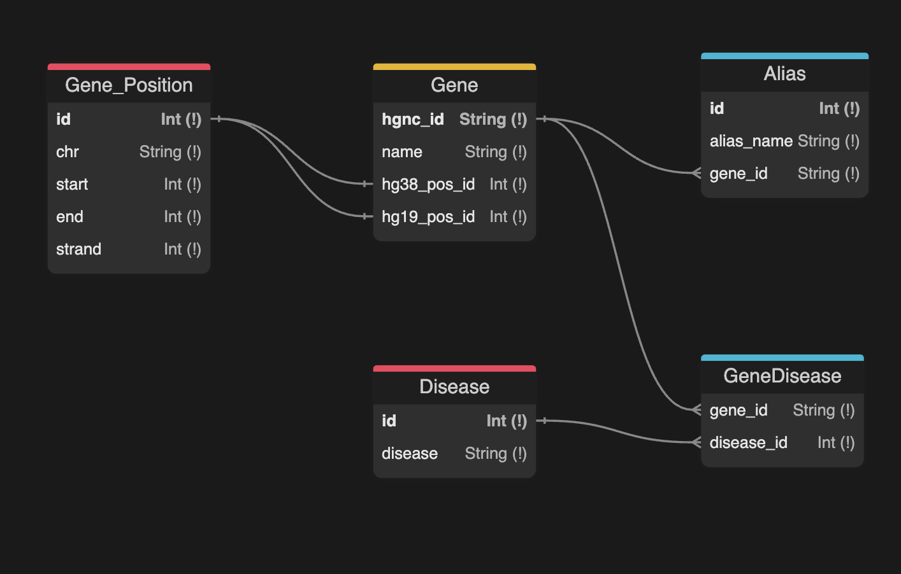

# BioNER
Program to extract genes and diseases from the PMID article 38790019. This program uses the PubTator3 API to extract annotations from the article and then links the annotated genes and diseases and saves them to a SQLite database.

### Running the Project:
To run the python code, start the virtual environment with `python -m venv venv`, then download all the dependencies with `pip install -r requirements.txt`, then run `prisma generate` to generate the SQLite tables. Finally, you can run `python ./src/extract_genes.py` which will extract the genes from the paper, save them to the database, and print the output to the terminal and to an output file. The base output file is `output.json`, this can be changed with the `--output` or `-o` argument when running the program (e.g. `python ./src/extract_genes.py -o new_output.json`).

To run the SQL queries, you can run `sqlite3 prisma/genes.db < src/gene_id_and_diseases.sql` and `sqlite3 prisma/genes.db < src/gene_name_and_aliases.sql`. These commands must be run after the python script so there is data in the tables.

### Schema

### Extraction of Annotations:
The PubTator3 API was used for annotation extract since it is a pre-processed database that can be queried for any PMID article. The main reasons that this API was used was because of its speed and reliability.

### Getting Gene-Disease Associations:
A simple proximity check was used to associate genes and diseases in this roject. If the annotations appeared in the same section of the paper, they were naively marked as associated. Given a more permanent implementation, this would need to be drastically improved to give more robust associations.

### Used APIs:
- Using PubTator for annotations (https://www.ncbi.nlm.nih.gov/research/pubtator3/api). Limitations of this API are that it can only provide annotations for PMID articles and it does not give gene-disease associations for full text articles like it can for the article abstract.
- Used MyGene.info for positional information since it is a fast and easy to use API that gives location information for multiple assemblies (https://docs.mygene.info/en/latest/index.html)

### Considered but not done:
- Used BERN2 api for annotations (http://bern2.korea.ac.kr/documentation).
    1. Try to use API since it allows inputing any string that will then be processed for NER annotations, but this API is currently down.
    2. Alternatively, the local installation of BERN2 can be used so any text can be annotated. Main limitation, it does not give gene-disease associations so this would need to be implemented.
- Used HGNC API to validate the genes from annotations and find more information about them (https://www.genenames.org/help/rest/).
    1. Didn't need to use this API since the mygene.info API gave all the information that was needed.
